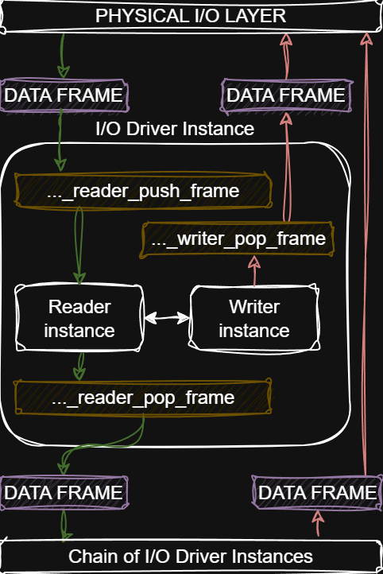

# tbcm_360_3000_he_dri
Eltek Valere PSU driver (Hardware-Agnostic)

This file contains the software implementation of the CAN2.0,
low-level device driver for Eltek Valere PSU.
The design is hardware-agnostic, requiring an external adaptation layer
for hardware interaction.

```DETAILS
Part name:  TBCM 360/3000 HE
Part No:    241121.000
Batch No:   794033

AC Input:   100-250V
Frequency:  45-66Hz
AC Current: 14Amax
AC Fuse:    25A F
DC Output:  250-420V/10Amax

Revision:   2.1
SW: 01.00/01.00
```

The driver can only communicate with one device at a time, but multiple
	instances of the driver can be run to achieve multiple devices support



WARNING: the communication protocol is only suitable for TBCM series
	and not compliant with protocol described in Doc No. 2086930

WARNING: the driver is not properly tested on real hardware!


## Conventions:
C89, Linux kernel style, MISRA, rule of 10, No hardware specific code,
only generic C and some binding layer. Be extra specific about types.

Scientific units where posible at end of the names, for example:
- timer_10s (timer_10s has a resolution of 10s per bit)
- power_150w (power 150W per bit or 0.15kw per bit)

Keep variables without units if they're unknown or not specified or hard
to define with short notation.

```LICENSE
Copyright (c) 2025 furdog <https://github.com/furdog>

SPDX-License-Identifier: 0BSD
```

Be free, be wise and take care of yourself!
With best wishes and respect, furdog
